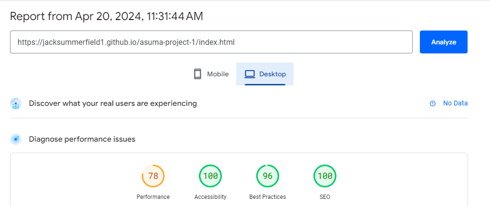

[ASUMA](https://jacksummerfield1.github.io/asuma-project-1/index.html) is designed as a database of updated information including the development of artificial intelligence. Its goal is to showcase the progression of AI from its early stages to its current status and track the rate at which it improves and the reasoning behind it. As it encompasses alot of information, a minimal aesthetic has been maintained to allow the important factors to be highlighted.

## UX

### Goals

#### Visitor Goals

The target audience for ASUMA are:
* People who are interested in AI
* People who may want to learn how to develop AI
* People that want to see where AI originated from
* People that who may want to understand the different forms of AI

User Goals are:
* View a collage of flipcards explaining different AI
* Watch a short video about AI
* Signup to a newsletter
* Get some insight on AI development
* Follow the journey of AI from a baby to where it is now

ASUMA fills these needs by:
* Opening with a simple background image with introductory information immediately
* Providing social media links to get frequent updates on AI and its development
* Providing interactive flipcards to provide information about the different types of AI
* Providing an easy signup form with an easy access T&C's page
* Providing an on-site YouTube video explaining AI in 5 minutes

#### Business Goals

The business goals of ASUMA are:
* Display and highlight updated information on AI in a simple way
* Gain subscribers through the newsletter
* Gain interest and connect with social media
* Provide easy ways to showcase types of AI and its entire process of development

#### User Stories

1. As a user interested in AI, I expect to see the basics, where, what, when and how did it come about
2. I expect a timeline of its development, from where it all began
3. I expect a video to be present to gain some visual knowledge on the topic
4. I expect to have easy access to updated information on AI, such as a newsletter to subscribe to
5. I expect to be able to follow the company through social media
6. I would like to be able to see news on other social media platforms not just the website

### Visual Design

#### Wireframes
[Wireframe1](assets/images/img-3189.jpg)
[Wireframe2](assets/images/img-3190.jpg)

#### Fonts

* The primary font, Architype Ballmer was chosen because its clean, modern design reflects the cutting-edge nature of AI technology, creating a visually appealing and professional appoearance for the website. It is also sans-serif, making it very easibly legible throughout different color schemes.

* The secondary font, Pattanakarn was chosen because its unique and stylised letterforms can help the website stand out, conveying a sense of innovation often associated with AI development.

#### Icons

* Icons are taken from the [FontAwesome](https://fontawesome.com/) Icon library and are utilised as classes in the <i> tag.
* As they are used as classes, they can easily be styled using other classes or IDs.
* Icons are used for the social media icons in the footer and the dropdown menu for mobile users.

#### Colors

* I wanted the site to maintain a minimal aesthetic, colors are very basic and clean and are associated with AI, people tend to think of blue when it comes to technology, hence the palette.

* Text is primarily written in white to contrast on the bold color backgrounds.

#### Animations

* The site consists of a small variety of animations to provide a sense of activity when arriving on specific pages.

* The uses page consists of 3D flipcard animations to allow some user interactivity with the site.

* The dev page consists of a timeline that moves down the page on load, followed by the images of each development fading in in 1s intervals.

## Features

### Page Elements

#### All Pages

Navbar

* The navbar is simple, effective and straight to the point. There are 4 pages, all encompassing a range of different topics and following an order of importance (highest being at the left and lowest on the right).
* For mobile users it is collapsible, making it more accessible for different device sizes.
* The mobile nav button has been placed to the right for ease of use with one hand.

Footer

* The footer is very basic but does what needs to be done
* Access to all socials directly, opening in a seperate tab to ensure the user can easily return back to the website
* Terms & Conditions page is also linked at the bottom for easy access before signing up to newsletter.

#### Index Page

Minimal and aesthetic background image to compliment the main content. Text content, table and iframe are all surrounded by familiar section styling with a black translucent background to make the page look seamless and free-flowing and a white font-color to make sure the information is under the spotlight. (That's why the users are here after all)

#### Dev Page

* Animated timeline along with relevant information about the development of AI since its early stages. Activity on the page helps make the information more interesting to the user and allows them to gain a greater understanding of the topic.

#### Uses Page

* 3D animated flipcards brings in that interactivity, it allows the user to fully immerse themselves into the site.
* Flipcards are a proven method for aiding memorization. By presenting information in a concise and repetitive format, they help users retain key concepts or information more effectively.
* Interactive elements like flipcards can increase user engagement on a website. Visitors are more likely to spend time exploring the content if they can actively participate in the learning process.

#### Newsletter Page

* Contains a short, concise and straight to the point form to signup to a newsletter.
* It allows the user to stay informed about the latest updates, news, promotions, and content from the website or business. This ensures that they are kept up-to-date with relevant information without having to actively visit the website regularly.
* Subscribing to the newsletter gives users access to these exclusive benefits, making them feel valued and incentivizing them to stay engaged with the website or business.

## Technologies Used

### Languages

* [HTML](https://www.w3.org/html/)
    * Page markup
* [CSS](https://www.w3.org/Style/CSS/Overview.en.html)
    * Styling

### Libraries
* [FontAwesome](https://fontawesome.com/)
    * Used for icons

### Platforms

* [Github](https://github.com/)
    * Storing code remotely and deployment.
* [Gitpod](https://gitpod.io/)
    * IDE for project development.

### Other Tools

* [Favicon Generator](https://favicon.io/)
    * Creating Favicons

* [Coolors](https://coolors.co/)
    * Creating color pallettes

* [Canva](https://www.canva.com/)
    * Creating flipcards

* [Color Identifier](https://imagecolorpicker.com/en)
    * Finding unkown colors on images

* [ChatGPT](https://chat.openai.com/)
    * Generating information for website

### Extra work (Out of syllabus)

* Including the use of 3D flipcard animations (Credit provided in code)
* Importing fonts into workspace as opposed to using Google fonts
* Including a timeline with basic animations

## Testing

### Methods

#### Validation

* HTML has been validated with [W3C HTML5 Validator](https://validator.w3.org/)
* CSS has been validated with [W3C CSS Validator](https://jigsaw.w3.org/css-validator/)

#### General Testing

* All forms have validation and will not submit without the proper information.
* .gitignore file has been included to prevent system file commits.
* External links open in a new tab.

#### Mobile Testing

* I tested the site personally on my iPhone device, going through all of the pages, checking buttons, links, forms dropdowns etc. I was personally unable to test Android.
* The site was sent to close family for them to follow the same process and check everything is working as it should.
* Chrome was used to inspect the site in mobile format, going through each page individually.

#### Desktop Testing

* The site was developed on a Windows PC and all testing occurred via Google Chrome.
* The site was tested by a few close family on numerous desktop devices including Macbooks.
* The site has not been tested with Internet Explorer, keeping in mind that support for the browser is gradually going.

### Fixed Bugs

* Timeline content for mobile users was too large for screen, so adjusted content width to appropriate value
* Navbar dropdown menu would appear beneath dev and uses page content, adjusted position of header and increased z-index value to ensure this doesn't occur

### Known Bugs

* iFrame doesn't follow correct ratio on larger screens

#### Lighthouse Statistics

<table>
    <tr>
        <th>Page</th>
        <th>PageSpeed Insights (Mobile)</th>
        <th>PageSpeed Insights (Desktop)</th>
        <th>Link for Proof (Mobile)</th>
        <th>Link for Proof (Desktop)</th>
    </tr>
    <tr>
        <td>index.html</td>
        <td></td>
        <td></td>
        <td><a href="https://pagespeed.web.dev/analysis/https-jacksummerfield1-github-io-asuma-project-1-index-html/6m87rr6bro?form_factor=mobile">Click Here</a></td>
        <td><a href="https://pagespeed.web.dev/analysis/https-jacksummerfield1-github-io-asuma-project-1-index-html/6m87rr6bro?form_factor=desktop">Click Here</a></td>
    </tr>
    <tr>
        <td>dev.html</td>
        <td></td>
        <td></td>
        <td><a href="https://pagespeed.web.dev/analysis/https-jacksummerfield1-github-io-asuma-project-1-dev-html/l5htks6pxy?form_factor=mobile">Click Here</a></td>
        <td><a href="https://pagespeed.web.dev/analysis/https-jacksummerfield1-github-io-asuma-project-1-dev-html/l5htks6pxy?form_factor=desktop">Click Here</a></td>
    </tr>
    <tr>
        <td>uses.html</td>
        <td></td>
        <td></td>
        <td><a href="https://pagespeed.web.dev/analysis/https-jacksummerfield1-github-io-asuma-project-1-uses-html/mqnlks88gg?form_factor=mobile">Click Here</a></td>
        <td><a href="https://pagespeed.web.dev/analysis/https-jacksummerfield1-github-io-asuma-project-1-uses-html/mqnlks88gg?form_factor=desktop">Click Here</a></td>
    </tr>
    <tr>
        <td>newsletter.html</td>
        <td></td>
        <td></td>
        <td><a href="https://pagespeed.web.dev/analysis/https-jacksummerfield1-github-io-asuma-project-1-newsletter-html/zd2wpm67sp?form_factor=mobile">Click Here</a></td>
        <td><a href="https://pagespeed.web.dev/analysis/https-jacksummerfield1-github-io-asuma-project-1-newsletter-html/zd2wpm67sp?form_factor=desktop">Click Here</a></td>
    </tr>
    <tr>
        <td>terms.html</td>
        <td></td>
        <td></td>
        <td><a href="https://pagespeed.web.dev/analysis/https-jacksummerfield1-github-io-asuma-project-1-terms-html/q5d11offv5?form_factor=mobile">Click Here</a></td>
        <td><a href="https://pagespeed.web.dev/analysis/https-jacksummerfield1-github-io-asuma-project-1-terms-html/q5d11offv5?form_factor=desktop">Click Here</a></td>
    </tr>
    <tr>
        <td>404.html</td>
        <td></td>
        <td></td>
        <td><a href="https://pagespeed.web.dev/analysis/https-jacksummerfield1-github-io-asuma-project-1-404-html/x9pqg9pu4p?form_factor=mobile">Click Here</a></td>
        <td><a href="https://pagespeed.web.dev/analysis/https-jacksummerfield1-github-io-asuma-project-1-404-html/x9pqg9pu4p?form_factor=desktop">Click Here</a></td>
    </tr>
</table>

## Deployment

### Github Deployment

#### Github Preparation

* A free github account

#### Github Instructions

1.  Log in to your GitHub account, navigate to [https://github.com/JackSummerfield1/asuma-project-1]
2. You can set up your own repository and copy or clone it, or you fork the repository.
3. git add, git commit and git push to a GitHub repository, if necessary.
4. GitHub pages will update from the master branch by default.
5. Go to **Settings** page of the repository.
6. Scroll down to the **GitHub Pages** section.
7. Select the Master Branch as the source and **Confirm** the selection.
8. Wait a minute or two and it should be live for viewing. See my own [here](https://jacksummerfield1.github.io/asuma-project-1/index.html)

## Credits and Contact

### Content

Nearly all text content was generated by the AI, GPT-3 at [ChatGPT](https://chat.openai.com/). Any code utilised from a site is documented and credited within the code.

### Contact

Please feel free to contact me at **summerzj10@gmail.com**

